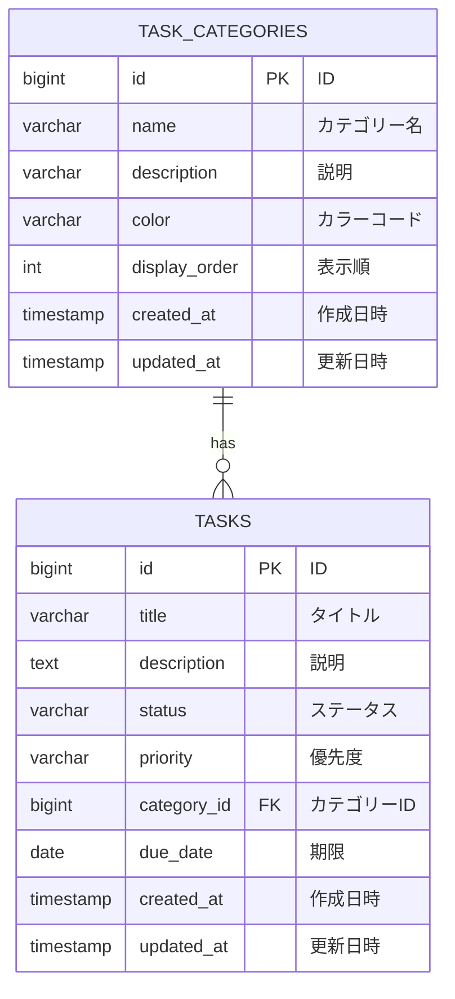

# ER図

**Source**: `src/main/resources/schema.sql`
**Date**: 2025-12-09

## Schema

## Tables

| No | Physical Name | Logical Name | Comment |
|:---|:---|:---|:---|
| 1 | task_categories | タスクカテゴリー | タスクカテゴリー管理テーブル |
| 2 | tasks | タスク | タスク管理テーブル |

## Relationships

| From Table | Relationship | To Table | Description |
|:---|:---|:---|:---|
| TASK_CATEGORIES | 1対多 | TASKS | 1つのカテゴリーは複数のタスクを持つ |

## Indexes

### task_categories
- `idx_task_categories_name` on `name`
- `idx_task_categories_display_order` on `display_order`

### tasks
- `idx_tasks_status` on `status`
- `idx_tasks_priority` on `priority`
- `idx_tasks_category_id` on `category_id`
- `idx_tasks_due_date` on `due_date`

## Constraints

### Foreign Keys
- **fk_tasks_category**: `tasks.category_id` → `task_categories.id`
  - ON DELETE: SET NULL
  - 説明: タスクは任意でカテゴリーに紐づく。カテゴリー削除時はNULLに設定される。
