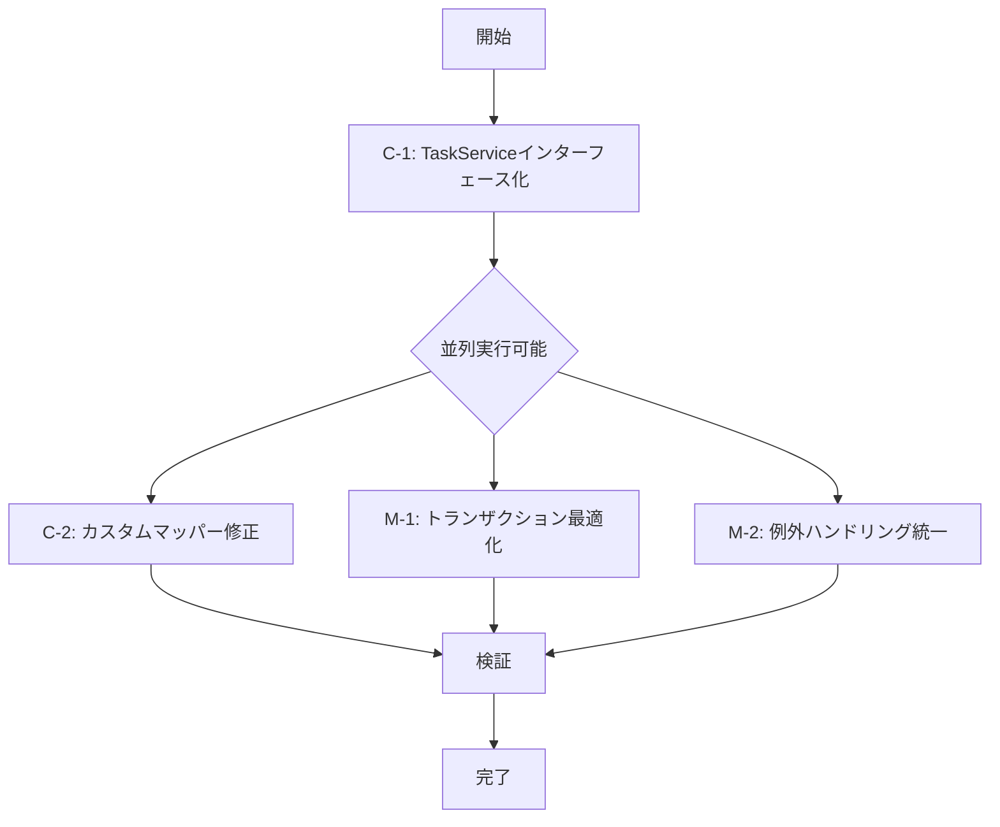

# コードレビュー指摘事項 修正計画書

**作成日**: 2025-12-10
**作成者**: pm-agent
**ステータス**: 計画策定完了

---

## 1. 概要

コードレビューで指摘された「最優先」および「高」優先度の問題について、修正タスクの実行順序と担当エージェントを明確化した計画書です。

**重要事項**:
- PMは計画策定と進捗管理のみを担当
- **実装作業は全てimplementation-specialistエージェントに委譲**
- 各タスクは独立性を考慮し、可能な限り並列実行

---

## 2. 修正対象一覧

### 2.1 最優先（Critical）

| ID | 指摘内容 | 影響範囲 | 修正難易度 |
|:---|:---|:---|:---|
| C-1 | TaskServiceのインターフェース化 | TaskService.java, TaskServiceImpl.java, 依存クラス | 中 |
| C-2 | カスタムマッパーのINSERT/UPDATE/DELETE削除 | TaskCustomMapper.xml, TaskServiceImpl.java | 低 |

### 2.2 高（Major）

| ID | 指摘内容 | 影響範囲 | 修正難易度 |
|:---|:---|:---|:---|
| M-1 | トランザクション境界の最適化 | TaskServiceImpl.java | 低 |
| M-2 | 例外ハンドリングの統一 | GlobalExceptionHandler.java, CategoryController.java | 低 |

---

## 3. 修正タスク詳細

### Task C-1: TaskServiceのインターフェース化

#### 概要
TaskServiceを現在の具象クラスからインターフェースに変更し、実装クラスTaskServiceImplを新規作成する。

#### 現状
```
TaskService.java → 具象クラス（インターフェース + 実装が混在）
```

#### 期待する修正後の状態
```
TaskService.java → インターフェースのみ
TaskServiceImpl.java → 実装クラス（新規作成）
```

#### 参照パターン
- `CategoryService.java` (インターフェース)
- `CategoryServiceImpl.java` (実装クラス)

#### 修正手順
1. 現在のTaskService.javaをTaskServiceImpl.javaとして保存
2. TaskService.javaを新規作成し、インターフェースとして定義
3. TaskServiceImpl.javaでTaskServiceインターフェースを実装
4. 以下のアノテーションを適用:
   - TaskService: アノテーションなし（インターフェース）
   - TaskServiceImpl: `@Service`, `@RequiredArgsConstructor`, `@Slf4j`
5. 依存クラス（Controller、Test等）でのimport修正

#### 影響範囲
- `src/main/java/com/example/taskmanager/task/service/TaskService.java`
- `src/main/java/com/example/taskmanager/task/service/TaskServiceImpl.java` (新規)
- `src/main/java/com/example/taskmanager/task/controller/TaskController.java`
- `src/test/java/com/example/taskmanager/task/service/TaskServiceTest.java`

#### 検証方法
- コンパイル成功
- 既存テストが全て通ること
- DIコンテナでのBean解決が正常に動作すること

#### 優先度: 最優先
#### 担当: implementation-specialist

---

### Task C-2: カスタムマッパーのINSERT/UPDATE/DELETE削除

#### 概要
TaskCustomMapper.xmlに存在する不要なINSERT/UPDATE/DELETE文を削除し、TaskServiceImplで自動生成のTaskMapperを使用するよう変更する。

#### 現状
- TaskCustomMapper.xmlに重複したINSERT/UPDATE/DELETE文が存在
- TaskServiceImplでTaskCustomMapperを使用

#### 期待する修正後の状態
- TaskCustomMapper.xmlにはSELECT文のみ残す
- TaskServiceImplで自動生成TaskMapperの`insert`, `updateByPrimaryKey`, `deleteByPrimaryKey`を使用

#### 修正手順
1. TaskCustomMapper.xmlを開き、以下を削除:
   - `<insert id="...">`要素
   - `<update id="...">`要素
   - `<delete id="...">`要素
2. TaskServiceImpl.javaで以下を修正:
   - create()メソッド: `taskMapper.insertSelective(task)` を使用
   - update()メソッド: `taskMapper.updateByPrimaryKeySelective(task)` を使用
   - delete()メソッド: `taskMapper.deleteByPrimaryKey(id)` を使用
3. TaskCustomMapperインターフェースからINSERT/UPDATE/DELETEメソッドを削除（存在する場合）

#### 影響範囲
- `src/main/resources/mapper/custom/task/TaskCustomMapper.xml`
- `src/main/java/com/example/taskmanager/task/mapper/TaskCustomMapper.java` (インターフェース)
- `src/main/java/com/example/taskmanager/task/service/TaskServiceImpl.java`

#### 検証方法
- コンパイル成功
- TaskServiceTestの全テストが通ること
- TaskController経由でCRUD操作が正常に動作すること

#### 優先度: 最優先
#### 担当: implementation-specialist
#### 依存関係: Task C-1完了後に実行（TaskServiceImplが存在している必要がある）

---

### Task M-1: トランザクション境界の最適化

#### 概要
TaskServiceImplのクラスレベル@Transactionalを削除し、各メソッドに適切なトランザクション設定を個別に適用する。

#### 現状
```java
@Service
@RequiredArgsConstructor
@Transactional  // ← クラスレベル
public class TaskServiceImpl implements TaskService {
    // ...
}
```

#### 期待する修正後の状態
```java
@Service
@RequiredArgsConstructor
public class TaskServiceImpl implements TaskService {

    @Transactional(readOnly = true)  // ← 参照系メソッド
    public List<TaskDto> findAll() { ... }

    @Transactional  // ← 更新系メソッド
    public TaskDto create(TaskForm form) { ... }
}
```

#### 修正手順
1. TaskServiceImplのクラスレベル@Transactionalを削除
2. 各メソッドに以下のルールでトランザクション設定:
   - **参照系メソッド**: `@Transactional(readOnly = true)`
     - findAll()
     - findByCondition()
     - findById()
     - findAllCategories()
   - **更新系メソッド**: `@Transactional`
     - create()
     - update()
     - delete()

#### 参照パターン
- `CategoryServiceImpl.java`の実装パターンに準拠

#### 影響範囲
- `src/main/java/com/example/taskmanager/task/service/TaskServiceImpl.java`

#### 検証方法
- コンパイル成功
- TaskServiceTestの全テストが通ること
- トランザクション境界が正しく機能していることをログで確認

#### 優先度: 高
#### 担当: implementation-specialist
#### 依存関係: Task C-1完了後に実行（TaskServiceImplが存在している必要がある）

---

### Task M-2: 例外ハンドリングの統一

#### 概要
CategoryInUseExceptionの処理をGlobalExceptionHandlerに集約し、CategoryControllerから個別のtry-catchを削除する。

#### 現状
- GlobalExceptionHandlerにCategoryInUseExceptionハンドラーが存在しない
- CategoryControllerで個別にtry-catchを実装

#### 期待する修正後の状態
- GlobalExceptionHandlerでCategoryInUseExceptionを統一的に処理
- CategoryControllerのtry-catchを削除し、シンプルなコード構造

#### 修正手順
1. GlobalExceptionHandler.javaに以下を追加:
```java
@ExceptionHandler(CategoryInUseException.class)
public String handleCategoryInUseException(
    CategoryInUseException ex,
    Model model
) {
    log.warn("Category in use: {}", ex.getMessage());
    model.addAttribute("errorCode", "CATEGORY_IN_USE");
    model.addAttribute("errorMessage", ex.getMessage());
    return "error/400"; // or appropriate error page
}
```

2. CategoryController.javaから以下を削除:
   - deleteメソッドのtry-catch構文
   - CategoryInUseExceptionの個別処理ロジック

#### 影響範囲
- `src/main/java/com/example/taskmanager/common/exception/GlobalExceptionHandler.java`
- `src/main/java/com/example/taskmanager/category/controller/CategoryController.java`

#### 検証方法
- コンパイル成功
- CategoryController経由で使用中カテゴリーの削除を試行し、適切なエラー画面が表示されること
- ログに適切なエラーメッセージが出力されること

#### 優先度: 高
#### 担当: implementation-specialist
#### 依存関係: なし（独立して実行可能）

---

## 4. 実行計画

### 4.1 実行順序



### 4.2 フェーズ別実行計画

#### Phase 1: 基盤修正（必須先行タスク）
- **Task C-1**: TaskServiceインターフェース化
- **実行条件**: なし（最初に実行）
- **担当**: implementation-specialist
- **想定所要時間**: 15分

#### Phase 2: 詳細修正（並列実行可能）
以下3タスクはC-1完了後、**並列実行可能**:

| タスク | 担当 | 依存 | 想定時間 |
|:---|:---|:---|:---|
| Task C-2 | implementation-specialist | C-1完了 | 10分 |
| Task M-1 | implementation-specialist | C-1完了 | 5分 |
| Task M-2 | implementation-specialist | なし | 10分 |

**並列実行の理由**:
- C-2とM-1: 同じTaskServiceImpl.javaを対象とするが、修正箇所が重複しない
- M-2: 完全に独立したファイルを対象とする

#### Phase 3: 総合検証
- 全修正完了後、統合テスト実行
- コンパイル確認: `mvn clean compile`
- テスト実行: `mvn test`
- アプリケーション起動確認: `mvn spring-boot:run`

---

## 5. implementation-specialistへの委譲指示書

### 5.1 Task C-1の委譲内容

```markdown
# 依頼内容
TaskServiceのインターフェース化を実施してください。

# 参照ファイル
- 現状: src/main/java/com/example/taskmanager/task/service/TaskService.java
- 参照パターン:
  - src/main/java/com/example/taskmanager/category/service/CategoryService.java
  - src/main/java/com/example/taskmanager/category/service/CategoryServiceImpl.java

# 実施内容
1. TaskService.javaをインターフェースとして再定義
2. TaskServiceImpl.javaを実装クラスとして新規作成
3. 依存クラスのimport修正（TaskController、TaskServiceTest等）

# 期待する成果
- TaskService.java: インターフェースのみ（実装ロジックなし）
- TaskServiceImpl.java: 実装クラス（@Service, @RequiredArgsConstructor, @Slf4j付与）
- コンパイルエラーがないこと
- 既存テストが全て通ること
```

### 5.2 Task C-2の委譲内容

```markdown
# 依頼内容
TaskCustomMapper.xmlから不要なINSERT/UPDATE/DELETE文を削除し、
TaskServiceImplで自動生成TaskMapperを使用するよう変更してください。

# 参照ファイル
- src/main/resources/mapper/custom/task/TaskCustomMapper.xml
- src/main/java/com/example/taskmanager/task/service/TaskServiceImpl.java

# 実施内容
1. TaskCustomMapper.xmlからINSERT/UPDATE/DELETE文を削除
2. TaskServiceImpl.javaでTaskMapperの以下メソッドを使用:
   - insertSelective()
   - updateByPrimaryKeySelective()
   - deleteByPrimaryKey()

# 期待する成果
- TaskCustomMapper.xmlにはSELECT文のみ残っていること
- TaskServiceImpl.javaで自動生成Mapperを使用していること
- TaskServiceTestが全て通ること
```

### 5.3 Task M-1の委譲内容

```markdown
# 依頼内容
TaskServiceImplのトランザクション境界を最適化してください。

# 参照ファイル
- src/main/java/com/example/taskmanager/task/service/TaskServiceImpl.java
- 参照パターン: src/main/java/com/example/taskmanager/category/service/CategoryServiceImpl.java

# 実施内容
1. クラスレベルの@Transactionalを削除
2. 参照系メソッドに@Transactional(readOnly = true)を付与
3. 更新系メソッドに@Transactionalを付与

# 期待する成果
- クラスレベルに@Transactionalが存在しないこと
- 各メソッドに適切なトランザクション設定がされていること
- TaskServiceTestが全て通ること
```

### 5.4 Task M-2の委譲内容

```markdown
# 依頼内容
CategoryInUseExceptionの処理をGlobalExceptionHandlerに集約してください。

# 参照ファイル
- src/main/java/com/example/taskmanager/common/exception/GlobalExceptionHandler.java
- src/main/java/com/example/taskmanager/category/controller/CategoryController.java

# 実施内容
1. GlobalExceptionHandlerにCategoryInUseExceptionハンドラーを追加
2. CategoryControllerからtry-catch構文を削除

# 期待する成果
- GlobalExceptionHandlerで統一的に例外処理されること
- CategoryControllerがシンプルな構造になること
- 使用中カテゴリーの削除時に適切なエラー画面が表示されること
```

---

## 6. 検証チェックリスト

修正完了後、以下を確認してください。

### 6.1 コンパイル・ビルド
- [ ] `mvn clean compile` が成功する
- [ ] 警告（Warning）が発生していない

### 6.2 テスト
- [ ] `mvn test` が成功する
- [ ] TaskServiceTestの全テストがPASSする
- [ ] TaskControllerTestの全テストがPASSする
- [ ] CategoryServiceImplTestの全テストがPASSする（影響確認）

### 6.3 動作確認
- [ ] `mvn spring-boot:run` でアプリケーションが起動する
- [ ] DIコンテナがTaskServiceImplを正しく解決する
- [ ] タスクのCRUD操作が正常に動作する
- [ ] 使用中カテゴリーの削除で適切なエラー画面が表示される

### 6.4 コード品質
- [ ] TaskServiceとCategoryServiceのパターンが統一されている
- [ ] 不要なコード（コメントアウト等）が残っていない
- [ ] ログ出力が適切に設定されている

---

## 7. リスク管理

### 7.1 想定されるリスク

| リスク | 影響度 | 対策 |
|:---|:---|:---|
| C-1実施時に依存クラスの修正漏れ | 高 | コンパイル時に全エラーを確認し、一括修正 |
| C-2実施時にカスタムMapperの削除範囲誤り | 中 | SELECT文は残すよう明示、レビューで確認 |
| M-1実施時にトランザクション設定ミス | 中 | CategoryServiceImplと同じパターン適用 |
| 並列実行時のマージコンフリクト | 低 | Phase 2は実質的に重複箇所なし |

### 7.2 ロールバック手順

修正に問題が発生した場合:
1. 該当ファイルのバックアップを確認
2. 元の状態に復元
3. 問題の原因を特定後、再実行

---

## 8. 進捗管理

### 8.1 progress.mdへの記録

修正完了後、`progress.md`に以下を追記してください。

```markdown
### Phase 4.5: コードレビュー指摘事項修正 ✅ 完了
- [x] C-1: TaskServiceインターフェース化
- [x] C-2: カスタムマッパーINSERT/UPDATE/DELETE削除
- [x] M-1: トランザクション境界最適化
- [x] M-2: 例外ハンドリング統一

**実施日**: 2025-12-10
**担当エージェント**: implementation-specialist
**成果物**:
- TaskService.java（インターフェース化）
- TaskServiceImpl.java（実装クラス）
- TaskCustomMapper.xml（不要SQL削除）
- GlobalExceptionHandler.java（CategoryInUseException対応）
```

### 8.2 完了報告フォーマット

全タスク完了時、以下のフォーマットで報告してください。

```markdown
# コードレビュー指摘事項修正 完了報告

## 実施日時
2025-12-10

## 修正内容
- [C-1] TaskServiceインターフェース化 ✅
- [C-2] カスタムマッパー修正 ✅
- [M-1] トランザクション最適化 ✅
- [M-2] 例外ハンドリング統一 ✅

## 検証結果
- コンパイル: PASS
- テスト実行: PASS
- アプリケーション起動: PASS

## 成果物
- src/main/java/com/example/taskmanager/task/service/TaskService.java
- src/main/java/com/example/taskmanager/task/service/TaskServiceImpl.java
- src/main/resources/mapper/custom/task/TaskCustomMapper.xml
- src/main/java/com/example/taskmanager/common/exception/GlobalExceptionHandler.java
- src/main/java/com/example/taskmanager/category/controller/CategoryController.java

## 備考
なし
```

---

## 9. 次のアクション

本修正計画完了後、以下のフェーズに進んでください。

1. **code-reviewerエージェント再実行**: 修正内容の妥当性確認
2. **test-specialistエージェント実行**: テストカバレッジ確認
3. **quality-analystエージェント実行**: コード品質メトリクス分析
4. **design-reviewerエージェント実行**: 設計書との整合性確認
5. **consistency-checkerエージェント実行**: 全体整合性チェック

---

## 10. 付録

### 10.1 関連ドキュメント

- コーディング規約: `docs/guidelines/java-coding-rules.md`
- アーキテクチャ設計書: `docs/architecture/architecture.md`
- 進捗管理: `progress.md`

### 10.2 変更履歴

| 日付 | バージョン | 変更内容 | 作成者 |
|:---|:---|:---|:---|
| 2025-12-10 | 1.0.0 | 初版作成 | pm-agent |

---

**この計画書に基づき、implementation-specialistエージェントへタスクを委譲してください。**
