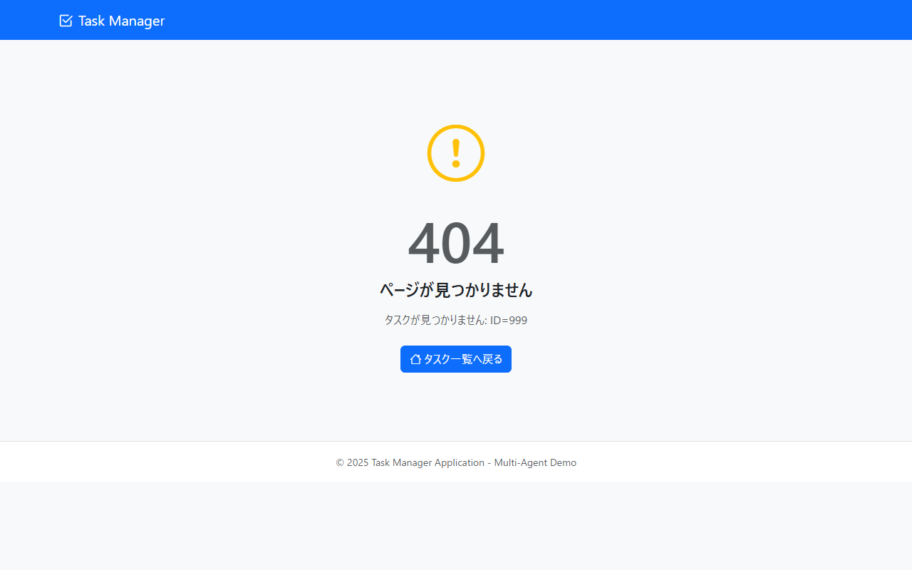

# 画面設計書

> **出力先**: `docs/screen/画面設計書/`
> **ファイル名**: `SCR-CMN-001_404エラー.md`

## 1. 文書情報
| 項目 | 内容 |
| :--- | :--- |
| **画面ID** | SCR-CMN-001 |
| **画面名** | 404エラー |
| **バージョン** | 1.1.0 |
| **作成日** | 2025-12-09 |
| **作成者** | 画面設計エージェント |
| **最終更新日** | 2025-12-09 |
| **最終更新者** | Claude (screen-designer) |

---

## 2. 概要
### 2.1. 画面目的
存在しないリソースへのアクセス時に表示されるエラー画面。ユーザーに状況を伝え、タスク一覧画面への復帰を促す。

### 2.2. 前提条件
- `TaskNotFoundException` が発生した場合に表示される
- GlobalExceptionHandler により自動的に遷移される

---

## 3. レイアウト
### 3.1. 画面スクリーンショット

> **📌 モックアップファイル**: `docs/mockups/05_error_404.html`

### 3.2. レイアウト構成
- **ヘッダー**: 共通ナビゲーションバー（Task Managerロゴとアイコン）
- **メインコンテンツ**:
  - エラー表示エリア（中央寄せ、縦パディング）:
    - 警告アイコン（`bi-exclamation-circle`、黄色、5rem サイズ）
    - エラーコード「404」（display-1サイズ、太字、グレー）
    - エラータイトル「ページが見つかりません」（h4サイズ）
    - エラーメッセージ（動的または固定メッセージ）
    - タスク一覧へ戻るボタン
- **フッター**: 共通フッター（© 2025 Task Manager Application - Multi-Agent Demo）

---

## 4. 画面遷移
### 4.1. 遷移元
| 画面ID | 画面名 | 遷移トリガー | 備考 |
| :--- | :--- | :--- | :--- |
| SCR-TASK-003 | タスク詳細 | 存在しないタスクIDでアクセス | TaskNotFoundException 発生 |
| SCR-TASK-004 | タスク編集 | 存在しないタスクIDでアクセス | TaskNotFoundException 発生 |
| - | 任意の画面 | 無効なURLへのアクセス | Spring Boot のデフォルト404ハンドリング |

### 4.2. 遷移先
| 画面ID | 画面名 | 遷移トリガー | 備考 |
| :--- | :--- | :--- | :--- |
| SCR-TASK-001 | タスク一覧 | 「タスク一覧へ戻る」ボタン押下 | - |

---

## 5. 画面項目一覧
| No. | 項目ID | 論理名 | ラベル/物理名 | 種別 | 必須 | 初期値/状態 | 備考 |
| :-: | :--- | :--- | :--- | :--- | :-: | :--- | :--- |
| 1 | I-501 | 警告アイコン | - | アイコン | - | 固定表示 | `bi-exclamation-circle`、`text-warning`、5rem サイズ |
| 2 | D-501 | エラーコード | 404 | テキスト表示 | - | 固定表示 | `display-1`、`fw-bold`、`text-muted` |
| 3 | D-502 | エラータイトル | ページが見つかりません | テキスト表示 | - | 固定表示 | `h4` サイズ |
| 4 | D-503 | エラーメッセージ | - | テキスト表示 | - | 条件付き表示 | `errorMessage` が存在する場合はその値、なければ「お探しのページは存在しないか、削除された可能性があります。」 |
| 5 | B-501 | タスク一覧へ戻るボタン | タスク一覧へ戻る | ボタン | - | 活性 | `/tasks` へ遷移、アイコン `bi-house` 付き、`btn-primary` |

---

## 6. イベント仕様
### 6.1. 初期表示処理 (`onLoad`)
1. `TaskNotFoundException` または無効なURLアクセスにより、GlobalExceptionHandler の `handleTaskNotFound()` メソッドが呼び出される
2. 例外メッセージをモデル属性 `errorMessage` に設定する
3. ビュー `error/404.html` をレンダリングする
4. エラーメッセージの表示ロジック:
   - `errorMessage` が存在する場合: その値を表示
   - `errorMessage` が存在しない場合: デフォルトメッセージ「お探しのページは存在しないか、削除された可能性があります。」を表示

### 6.2. 入力項目変更時 (`onChange`)
- （入力項目なし）

### 6.3. ボタン押下時 (`onClick`)
#### タスク一覧へ戻るボタン（B-501）
1. `/tasks` へ遷移する

---

## 7. 画面チェック仕様（バリデーション）
### 7.1. 登録/更新ボタン押下時 (クライアントサイド)
| No. | 対象項目 | チェック内容 | 条件/正規表現 | エラーメッセージ |
| :-: | :--- | :--- | :--- | :--- |
| - | - | - | - | 本画面では入力項目が存在しないため、バリデーションは実施しない |
