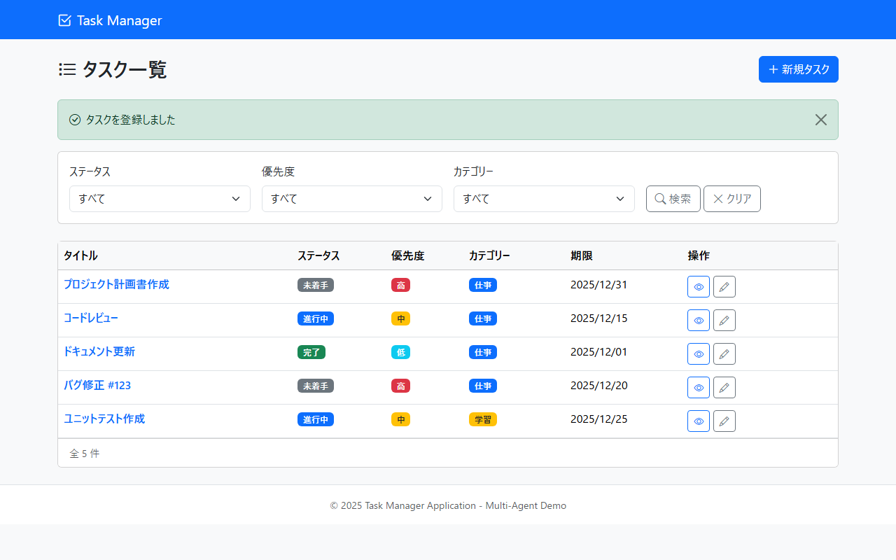

# 画面設計書

## 1. 文書情報
| 項目 | 内容 |
| :--- | :--- |
| **画面ID** | SCR-TASK-001 |
| **画面名** | タスク一覧 |
| **バージョン** | 1.0.0 |
| **作成日** | 2025-12-09 |
| **作成者** | 画面設計エージェント |
| **最終更新日** | 2025-12-09 |
| **最終更新者** | PM（編集ボタン削除対応） |

---

## 2. 概要
### 2.1. 画面目的
登録されているタスクを一覧表示し、ステータス・優先度・カテゴリーによる絞り込み検索を行う画面。新規タスクの登録、既存タスクの詳細閲覧・編集を起点とする。

### 2.2. 前提条件
- タスク管理システムにアクセス可能であること
- データベースにタスクテーブル・カテゴリーテーブルが存在すること

---

## 3. レイアウト
### 3.1. 画面スクリーンショット

> **📌 画像パスの指定方法**
>
> 画像ファイルは `docs/screen/images/` ディレクトリに配置してください。
> ファイル名は `{画面ID}.png` の形式とします。
>
> | 画像格納パス | ファイル名形式 |
> | :--- | :--- |
> | `docs/screen/images/` | `{画面ID}.png` |
>
> **例**: 画面ID `SCR-TASK-001` の場合
> ```markdown
> 
> ```
>
> ※ 画面設計書から画像への相対パスは `../images/{画面ID}.png` となります。

<!-- 以下に実際の画像パスを記載 -->


> **代替参照**: モックアップファイル `docs/mockups/01_task_list.html`

### 3.2. レイアウト構成
- **ヘッダー**: 共通ナビゲーションバー（サービスロゴ「Task Manager」、Bootstrapプライマリカラー背景）
- **メインコンテンツ**:
  - **タイトルセクション**: 画面タイトル「タスク一覧」（アイコン `bi-list-task` 付き）、新規タスク登録ボタン（右上配置）
  - **成功メッセージエリア**: 操作完了時のフィードバックを表示（dismissible alert、条件付き表示）
  - **フィルターエリア**: カード形式で検索条件を配置
    - ステータス、優先度、カテゴリーのセレクトボックス
    - 検索ボタン、クリアボタン
  - **タスク一覧テーブル**: カード形式のテーブルコンテナ、レスポンシブ対応（横スクロール可能）、件数表示フッター
- **フッター**: 共通フッター情報（コピーライト表示）

---

## 4. 画面遷移
### 4.1. 遷移元
| 画面ID | 画面名 | 遷移トリガー | 備考 |
| :--- | :--- | :--- | :--- |
| SCR-TASK-002 | タスク登録 | キャンセルボタン押下 | - |
| SCR-TASK-003 | タスク詳細 | 「一覧に戻る」ボタン押下 | - |
| SCR-TASK-004 | タスク編集 | キャンセル・更新完了後 | 成功メッセージ付き |
| SCR-CMN-001 | 404エラー | 「タスク一覧へ戻る」リンク押下 | - |
| SCR-CMN-002 | 500エラー | 「タスク一覧へ戻る」リンク押下 | - |

### 4.2. 遷移先
| 画面ID | 画面名 | 遷移トリガー | 備考 |
| :--- | :--- | :--- | :--- |
| SCR-TASK-002 | タスク登録 | 「新規タスク」ボタン押下 | `/tasks/new` へ遷移 |
| SCR-TASK-003 | タスク詳細 | タイトルリンク押下、「詳細」ボタン押下 | `/tasks/{id}` へ遷移 |

---

## 5. 画面項目一覧
| No. | 項目ID | 論理名 | ラベル/物理名 | 種別 | 必須 | 初期値/状態 | 備考 |
| :-: | :--- | :--- | :--- | :--- | :-: | :--- | :--- |
| 1 | S-101 | 画面タイトル | タスク一覧 | テキスト表示 | - | 固定表示 | アイコン `bi-list-task` 付き |
| 2 | B-101 | 新規タスクボタン | 新規タスク | ボタン | - | 活性 | `/tasks/new` へ遷移、アイコン `bi-plus-lg` 付き |
| 3 | M-101 | 成功メッセージ | - | アラート | - | 非表示 | `successMessage` が存在する場合に表示、dismissible |
| 4 | F-101 | ステータスフィルター | ステータス | セレクトボックス | - | 空（すべて） | TaskStatus enum の全値を選択肢として表示 |
| 5 | F-102 | 優先度フィルター | 優先度 | セレクトボックス | - | 空（すべて） | TaskPriority enum の全値を選択肢として表示 |
| 6 | F-103 | カテゴリーフィルター | カテゴリー | セレクトボックス | - | 空（すべて） | カテゴリーマスタから取得した選択肢を表示 |
| 7 | B-102 | 検索ボタン | 検索 | ボタン | - | 活性 | フィルター条件でGET送信、アイコン `bi-search` 付き |
| 8 | B-103 | クリアボタン | クリア | ボタン | - | 活性 | `/tasks` へ遷移（条件なし）、アイコン `bi-x-lg` 付き |
| 9 | T-101 | タスク一覧テーブル | - | テーブル | - | - | 6列（タイトル、ステータス、優先度、カテゴリー、期限、操作） |
| 10 | T-101-1 | タイトルカラム | タイトル | リンク | - | - | タスク詳細へのリンク、幅30% |
| 11 | T-101-2 | ステータスカラム | ステータス | バッジ | - | - | 色分け: TODO=gray, IN_PROGRESS=blue, DONE=green、幅12% |
| 12 | T-101-3 | 優先度カラム | 優先度 | バッジ | - | - | 色分け: LOW=info, MEDIUM=warning, HIGH=danger、幅10% |
| 13 | T-101-4 | カテゴリーカラム | カテゴリー | バッジ | - | - | カテゴリーの色を背景色として表示、未設定時は「-」、幅13% |
| 14 | T-101-5 | 期限カラム | 期限 | テキスト表示 | - | - | `yyyy/MM/dd` 形式、未設定時は「-」、幅15% |
| 15 | T-101-6 | 操作カラム | 操作 | ボタン | - | - | 詳細ボタンを配置、幅20% |
| 16 | B-104 | 詳細ボタン | - | ボタン | - | 活性 | アイコンのみ `bi-eye`、title属性「詳細」 |
| 17 | D-101 | 件数表示 | - | テキスト表示 | - | 動的 | 「全 X 件」形式で表示、カードフッターに配置 |
| 18 | D-102 | 空メッセージ | - | テキスト表示 | - | 条件付き表示 | タスクが0件の場合「タスクがありません」を表示 |

---

## 6. イベント仕様
### 6.1. 初期表示処理 (`onLoad`)
1. コントローラー `GET /tasks` が呼び出される
2. クエリパラメータ `status`, `priority`, `categoryId` の有無を確認する
3. パラメータがある場合は条件検索、ない場合は全件取得を実行する
4. 以下のデータをモデルに設定する:
   - `tasks`: タスクリスト（TaskDto）
   - `statuses`: TaskStatus enum の全値
   - `priorities`: TaskPriority enum の全値
   - `categories`: カテゴリーマスタの全レコード
   - `selectedStatus`, `selectedPriority`, `selectedCategoryId`: 選択中のフィルター条件
   - `successMessage`: フラッシュ属性（存在する場合のみ）
5. ビュー `task/list.html` をレンダリングする

### 6.2. 入力項目変更時 (`onChange`)
本画面では入力項目変更時の特別な処理は実施しない

### 6.3. ボタン押下時 (`onClick`)
#### 6.3.1. 新規タスクボタン (`B-101`)
1. `/tasks/new` へ遷移する

#### 6.3.2. 検索ボタン (`B-102`)
1. フォーム内の選択値を取得する
2. GET メソッドで `/tasks` へリクエストを送信する
3. クエリパラメータとして `status`, `priority`, `categoryId` を付与する（値が空の場合は送信しない）
4. サーバー側で条件に合致するタスクを検索し、画面を再描画する

#### 6.3.3. クリアボタン (`B-103`)
1. `/tasks` へ遷移する（クエリパラメータなし）
2. 全件表示状態に戻る

#### 6.3.4. タイトルリンク (`T-101-1`)
1. クリックされた行のタスクID を取得する
2. `/tasks/{id}` へ遷移する

#### 6.3.5. 詳細ボタン (`B-104`)
1. クリックされた行のタスクID を取得する
2. `/tasks/{id}` へ遷移する

---

## 7. 画面チェック仕様（バリデーション）
### 7.1. 登録/更新ボタン押下時 (クライアントサイド)
本画面ではクライアントサイドのバリデーションは実施しない

**理由**: 検索条件はすべて任意入力のため、入力値の検証は不要
