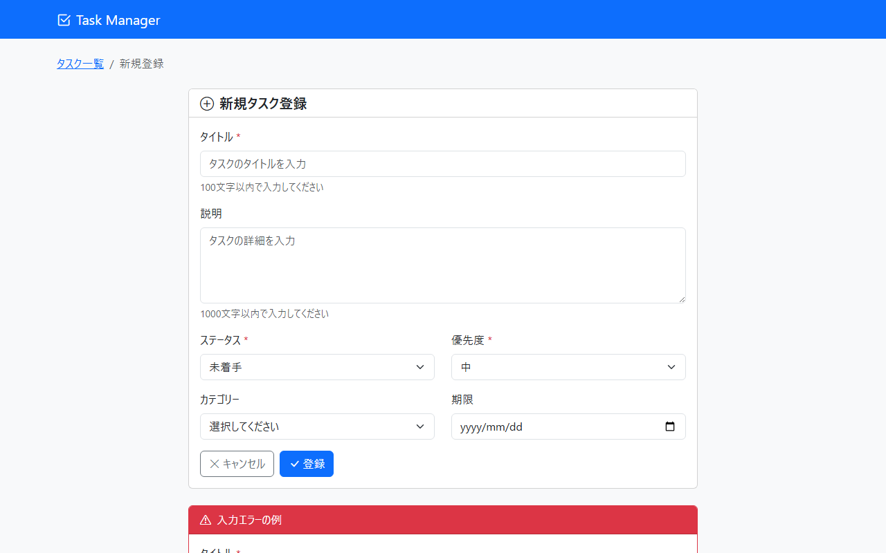

# 画面設計書

> **出力先**: `docs/screen/画面設計書/`
> **ファイル名**: `SCR-TASK-002_タスク登録.md`

## 1. 文書情報
| 項目 | 内容 |
| :--- | :--- |
| **画面ID** | SCR-TASK-002 |
| **画面名** | タスク登録 |
| **バージョン** | 1.1.0 |
| **作成日** | 2025-12-09 |
| **作成者** | 画面設計エージェント |
| **最終更新日** | 2025-12-09 |
| **最終更新者** | Claude (screen-designer) |

---

## 2. 概要
### 2.1. 画面目的
新規タスクを登録するための画面。タスクの基本情報を入力し、バリデーションを実施した上でデータベースに登録する。

### 2.2. 前提条件
- タスク管理システムにアクセス可能であること
- カテゴリーマスタにデータが存在すること（任意項目のため空でも可）

---

## 3. レイアウト
### 3.1. 画面スクリーンショット

> **📌 モックアップファイル**: `docs/mockups/02_task_new.html`

### 3.2. レイアウト構成
- **ヘッダー**: 共通ナビゲーションバー（Task Managerロゴとアイコン）
- **メインコンテンツ**:
  - パンくずリスト: タスク一覧 > 新規登録
  - フォームカード:
    - カードヘッダー: 「新規タスク登録」（アイコン `bi-plus-circle` 付き）
    - カードボディ: 入力フォーム
      - タイトル（必須、テキスト入力、maxlength=100）
      - 説明（任意、テキストエリア、maxlength=1000）
      - ステータス（必須、セレクトボックス、初期値: TODO）
      - 優先度（必須、セレクトボックス、初期値: MEDIUM）
      - カテゴリー（任意、セレクトボックス）
      - 期限（任意、日付入力）
    - ボタンエリア: キャンセル、登録
  - バリデーションエラー表示サンプルカード（モックアップのみ）
- **フッター**: 共通フッター（© 2025 Task Manager Application - Multi-Agent Demo）

---

## 4. 画面遷移
### 4.1. 遷移元
| 画面ID | 画面名 | 遷移トリガー | 備考 |
| :--- | :--- | :--- | :--- |
| SCR-TASK-001 | タスク一覧 | 「新規タスク」ボタン押下 | - |

### 4.2. 遷移先
| 画面ID | 画面名 | 遷移トリガー | 備考 |
| :--- | :--- | :--- | :--- |
| SCR-TASK-001 | タスク一覧 | 「キャンセル」ボタン押下 | 入力内容は破棄される |
| SCR-TASK-003 | タスク詳細 | 登録成功時 | 登録したタスクの詳細画面へリダイレクト、成功メッセージ表示 |

---

## 5. 画面項目一覧
| No. | 項目ID | 論理名 | ラベル/物理名 | 種別 | 必須 | 初期値/状態 | 備考 |
| :-: | :--- | :--- | :--- | :--- | :-: | :--- | :--- |
| 1 | BC-201 | パンくずリスト | - | ナビゲーション | - | 固定表示 | タスク一覧 > 新規登録 |
| 2 | S-201 | 画面タイトル | 新規タスク登録 | テキスト表示 | - | 固定表示 | アイコン `bi-plus-circle` 付き |
| 3 | I-201 | タイトル入力 | タイトル | テキスト入力 | ✔ | 空 | maxlength=100、placeholder="タスクのタイトルを入力" |
| 4 | H-201 | タイトルヘルプ | - | ヘルプテキスト | - | 固定表示 | 「100文字以内で入力してください」 |
| 5 | E-201 | タイトルエラー | - | エラーメッセージ | - | 非表示 | バリデーションエラー時に表示 |
| 6 | I-202 | 説明入力 | 説明 | テキストエリア | - | 空 | rows=4、maxlength=1000、placeholder="タスクの詳細を入力" |
| 7 | H-202 | 説明ヘルプ | - | ヘルプテキスト | - | 固定表示 | 「1000文字以内で入力してください」 |
| 8 | E-202 | 説明エラー | - | エラーメッセージ | - | 非表示 | バリデーションエラー時に表示 |
| 9 | I-203 | ステータス選択 | ステータス | セレクトボックス | ✔ | TODO | 選択肢: TODO（未着手）、IN_PROGRESS（進行中）、DONE（完了） |
| 10 | E-203 | ステータスエラー | - | エラーメッセージ | - | 非表示 | バリデーションエラー時に表示 |
| 11 | I-204 | 優先度選択 | 優先度 | セレクトボックス | ✔ | MEDIUM | 選択肢: HIGH（高）、MEDIUM（中）、LOW（低） |
| 12 | E-204 | 優先度エラー | - | エラーメッセージ | - | 非表示 | バリデーションエラー時に表示 |
| 13 | I-205 | カテゴリー選択 | カテゴリー | セレクトボックス | - | 空 | カテゴリーマスタから動的取得、初期値: 空（選択してください） |
| 14 | I-206 | 期限入力 | 期限 | 日付入力 | - | 空 | type="date" |
| 15 | E-206 | 期限エラー | - | エラーメッセージ | - | 非表示 | バリデーションエラー時に表示 |
| 16 | B-201 | キャンセルボタン | キャンセル | ボタン | - | 活性 | `/tasks` へ遷移、アイコン `bi-x-lg` 付き |
| 17 | B-202 | 登録ボタン | 登録 | ボタン | - | 活性 | フォーム送信、アイコン `bi-check-lg` 付き |

---

## 6. イベント仕様
### 6.1. 初期表示処理 (`onLoad`)
1. コントローラー `GET /tasks/new` が呼び出される
2. 以下のデータをモデルに設定する:
   - `taskForm`: 初期値設定済みの TaskForm (status=TODO, priority=MEDIUM)
   - `statuses`: TaskStatus enum の全値
   - `priorities`: TaskPriority enum の全値
   - `categories`: カテゴリーマスタの全レコード
3. ビュー `task/form.html` をレンダリングする

### 6.2. 入力項目変更時 (`onChange`)
- （特別な処理なし）

### 6.3. ボタン押下時 (`onClick`)
#### キャンセルボタン（B-201）
1. `/tasks` へ遷移する
2. 入力内容は破棄される

#### 登録ボタン（B-202）
1. フォーム内の入力値を取得する
2. POST メソッドで `/tasks` へリクエストを送信する
3. サーバーサイドバリデーションを実行する（詳細は「7. 画面チェック仕様」を参照）
4. バリデーションエラーがある場合:
   - BindingResult にエラー情報が格納される
   - モデルに必要なマスタデータを再設定する
   - ビュー `task/form.html` を再表示する
   - エラーメッセージが各入力項目の下に表示される（`invalid-feedback`）
   - 入力済みの値は保持される
5. バリデーション成功の場合:
   - TaskService.create() を呼び出してタスクを登録する
   - フラッシュ属性に成功メッセージ「タスクを登録しました」を設定する
   - 登録したタスクの詳細画面 `/tasks/{id}` へリダイレクトする

---

## 7. 画面チェック仕様（バリデーション）
### 7.1. 登録/更新ボタン押下時 (クライアントサイド)
| No. | 対象項目 | チェック内容 | 条件/正規表現 | エラーメッセージ |
| :-: | :--- | :--- | :--- | :--- |
| 1 | I-201 | 必須入力 | `@NotBlank` | 「タイトルを入力してください」 |
| 2 | I-201 | 最大文字数 | `@Size(max=100)` | 「タイトルは100文字以内で入力してください」 |
| 3 | I-202 | 最大文字数 | `@Size(max=1000)` | 「説明は1000文字以内で入力してください」 |
| 4 | I-203 | 必須選択 | `@NotNull` | 「ステータスを選択してください」 |
| 5 | I-204 | 必須選択 | `@NotNull` | 「優先度を選択してください」 |
