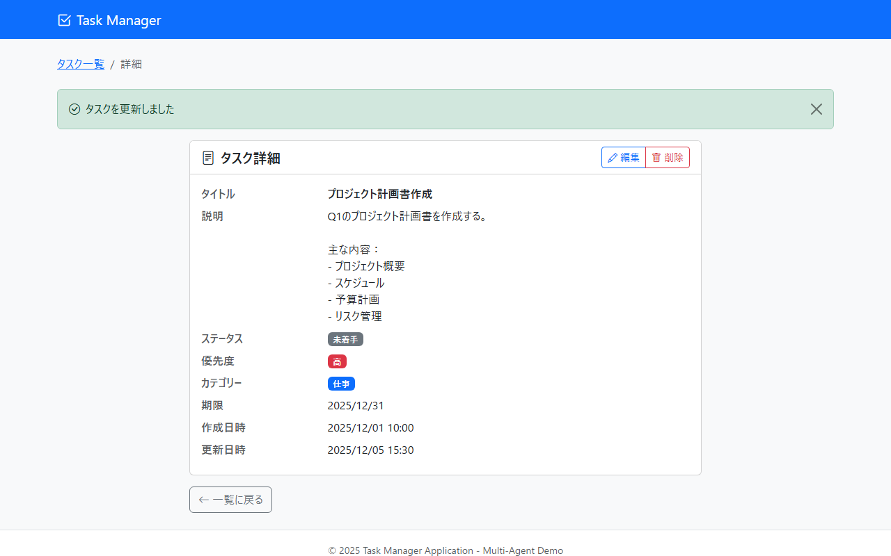

# 画面設計書

> **出力先**: `docs/screen/画面設計書/`
> **ファイル名**: `SCR-TASK-003_タスク詳細.md`

## 1. 文書情報
| 項目 | 内容 |
| :--- | :--- |
| **画面ID** | SCR-TASK-003 |
| **画面名** | タスク詳細 |
| **バージョン** | 1.1.0 |
| **作成日** | 2025-12-09 |
| **作成者** | 画面設計エージェント |
| **最終更新日** | 2025-12-09 |
| **最終更新者** | Claude (screen-designer) |

---

## 2. 概要
### 2.1. 画面目的
選択したタスクの詳細情報を表示する画面。タスクの編集・削除操作の起点となる。

### 2.2. 前提条件
- タスクIDが有効であること
- 指定されたタスクがデータベースに存在すること
- 存在しない場合は404エラー画面（SCR-CMN-001）へ遷移する

---

## 3. レイアウト
### 3.1. 画面スクリーンショット

> **📌 モックアップファイル**: `docs/mockups/03_task_detail.html`

### 3.2. レイアウト構成
- **ヘッダー**: 共通ナビゲーションバー（Task Managerロゴとアイコン）
- **メインコンテンツ**:
  - パンくずリスト: タスク一覧 > 詳細
  - 成功メッセージエリア（登録・更新完了時に表示）
  - 詳細情報カード:
    - カードヘッダー:
      - 左側: 画面タイトル「タスク詳細」（アイコン `bi-file-text` 付き）
      - 右側: 編集・削除ボタン（ボタングループ）
    - カードボディ:
      - 定義リスト形式でタスク情報を表示
      - 項目: タイトル、説明、ステータス、優先度、カテゴリー、期限、作成日時、更新日時
  - 一覧に戻るボタン
  - 削除確認モーダル（削除ボタン押下時に表示）
- **フッター**: 共通フッター（© 2025 Task Manager Application - Multi-Agent Demo）

---

## 4. 画面遷移
### 4.1. 遷移元
| 画面ID | 画面名 | 遷移トリガー | 備考 |
| :--- | :--- | :--- | :--- |
| SCR-TASK-001 | タスク一覧 | タイトルリンク押下、「詳細」ボタン押下 | - |
| SCR-TASK-002 | タスク登録 | 登録成功時 | 成功メッセージ「タスクを登録しました」表示 |
| SCR-TASK-004 | タスク編集 | キャンセル、更新成功時 | 更新時は成功メッセージ「タスクを更新しました」表示 |

### 4.2. 遷移先
| 画面ID | 画面名 | 遷移トリガー | 備考 |
| :--- | :--- | :--- | :--- |
| SCR-TASK-001 | タスク一覧 | 「一覧に戻る」ボタン押下、削除成功時 | 削除時は成功メッセージ「タスクを削除しました」表示 |
| SCR-TASK-004 | タスク編集 | 「編集」ボタン押下 | `/tasks/{id}/edit` へ遷移 |
| SCR-CMN-001 | 404エラー | タスクが存在しない場合 | TaskNotFoundException 発生時 |
| SCR-CMN-002 | 500エラー | システムエラー発生時 | Exception 発生時 |

---

## 5. 画面項目一覧
| No. | 項目ID | 論理名 | ラベル/物理名 | 種別 | 必須 | 初期値/状態 | 備考 |
| :-: | :--- | :--- | :--- | :--- | :-: | :--- | :--- |
| 1 | BC-301 | パンくずリスト | - | ナビゲーション | - | 固定表示 | タスク一覧 > 詳細 |
| 2 | M-301 | 成功メッセージ | - | アラート | - | 条件付き表示 | `successMessage` が存在する場合に表示、`alert-success` 、dismissible |
| 3 | S-301 | 画面タイトル | タスク詳細 | テキスト表示 | - | 固定表示 | アイコン `bi-file-text` 付き |
| 4 | B-301 | 編集ボタン | 編集 | ボタン | - | 活性 | `/tasks/{id}/edit` へ遷移、アイコン `bi-pencil` 付き、`btn-outline-primary btn-sm` |
| 5 | B-302 | 削除ボタン | 削除 | ボタン | - | 活性 | 削除確認モーダル表示、アイコン `bi-trash` 付き、`btn-outline-danger btn-sm` |
| 6 | D-301 | タイトル表示 | タイトル | テキスト表示 | - | - | フォントウェイト: medium |
| 7 | D-302 | 説明表示 | 説明 | テキスト表示 | - | - | `white-space: pre-wrap`、未設定時は「-」 |
| 8 | D-303 | ステータス表示 | ステータス | バッジ | - | - | TODO=gray（bg-secondary）、IN_PROGRESS=blue（bg-primary）、DONE=green（bg-success） |
| 9 | D-304 | 優先度表示 | 優先度 | バッジ | - | - | LOW=info（bg-info）、MEDIUM=warning（bg-warning）、HIGH=danger（bg-danger） |
| 10 | D-305 | カテゴリー表示 | カテゴリー | バッジ | - | - | カテゴリーの色を背景色として表示、未設定時は「-」 |
| 11 | D-306 | 期限表示 | 期限 | テキスト表示 | - | - | `yyyy/MM/dd` 形式、未設定時は「-」 |
| 12 | D-307 | 作成日時表示 | 作成日時 | テキスト表示 | - | - | `yyyy/MM/dd HH:mm` 形式 |
| 13 | D-308 | 更新日時表示 | 更新日時 | テキスト表示 | - | - | `yyyy/MM/dd HH:mm` 形式 |
| 14 | B-303 | 一覧に戻るボタン | 一覧に戻る | ボタン | - | 活性 | `/tasks` へ遷移、アイコン `bi-arrow-left` 付き、`btn-outline-secondary` |
| 15 | MD-301 | 削除確認モーダル | 削除確認 | モーダルダイアログ | - | 非表示 | B-302 押下時に表示 |
| 16 | MD-301-T | モーダルタイトル | 削除確認 | テキスト表示 | - | 固定表示 | 警告アイコン `bi-exclamation-triangle text-danger` 付き |
| 17 | MD-301-M | モーダルメッセージ | - | テキスト表示 | - | 動的 | 「このタスクを削除してもよろしいですか？」+ タスクタイトル（strong） |
| 18 | B-304 | モーダルキャンセル | キャンセル | ボタン | - | 活性 | モーダルを閉じる、`btn-outline-secondary` |
| 19 | B-305 | モーダル削除実行 | 削除 | ボタン | - | 活性 | フォーム送信、アイコン `bi-trash` 付き、`btn-danger` |

---

## 6. イベント仕様
### 6.1. 初期表示処理 (`onLoad`)
1. コントローラー `GET /tasks/{id}` が呼び出される
2. パスパラメータから `id` を取得する
3. TaskService.findById(id) を呼び出し、タスク情報を取得する
4. タスクが存在しない場合:
   - `TaskNotFoundException` がスローされる
   - GlobalExceptionHandler が捕捉し、404エラー画面（SCR-CMN-001）へ遷移する
5. タスクが存在する場合:
   - モデルに `task` (TaskDto) を設定する
   - フラッシュ属性に `successMessage` が存在する場合は設定する
   - ビュー `task/detail.html` をレンダリングする

### 6.2. 入力項目変更時 (`onChange`)
- （入力項目なし）

### 6.3. ボタン押下時 (`onClick`)
#### 編集ボタン（B-301）
1. `/tasks/{id}/edit` へ遷移する

#### 削除ボタン（B-302）
1. Bootstrap モーダル `#deleteModal` を表示する（`data-bs-toggle="modal"` により自動実行）
2. モーダル内にタスクタイトルを表示する

#### モーダルキャンセルボタン（B-304）
1. モーダルを閉じる（`data-bs-dismiss="modal"` により自動実行）
2. 削除処理は実行されない

#### モーダル削除実行ボタン（B-305）
1. フォーム送信により `POST /tasks/{id}/delete` が実行される
2. TaskService.delete(id) を呼び出し、タスクを削除する
3. フラッシュ属性に成功メッセージ「タスクを削除しました」を設定する
4. タスク一覧画面（SCR-TASK-001） `/tasks` へリダイレクトする

#### 一覧に戻るボタン（B-303）
1. `/tasks` へ遷移する

---

## 7. 画面チェック仕様（バリデーション）
### 7.1. 登録/更新ボタン押下時 (クライアントサイド)
| No. | 対象項目 | チェック内容 | 条件/正規表現 | エラーメッセージ |
| :-: | :--- | :--- | :--- | :--- |
| - | - | - | - | 本画面では入力項目が存在しないため、バリデーションは実施しない |
